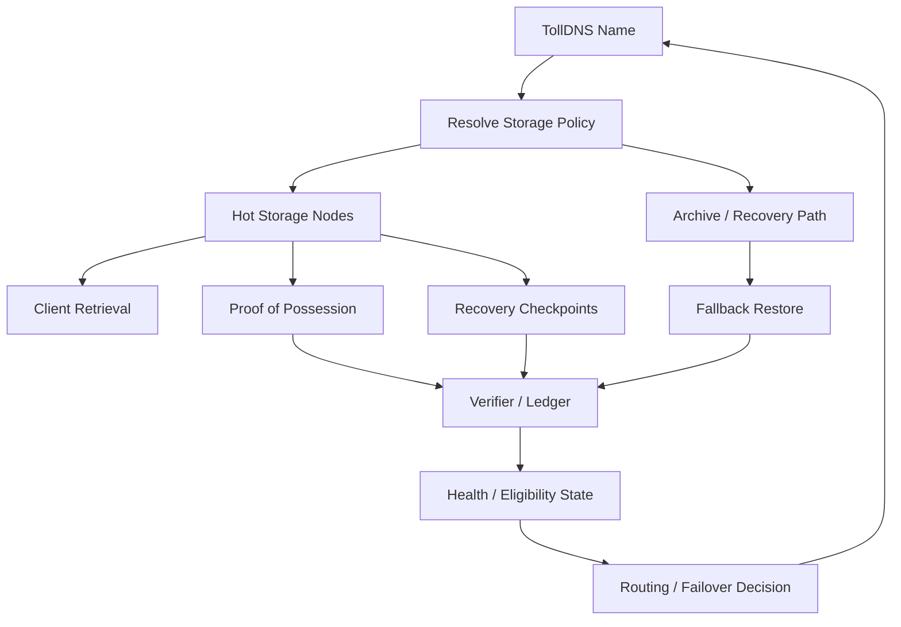

TollDNS helps the storage method by providing:

naming
routing
policy resolution
failover control
a stable way to locate hot storage vs archive paths
The storage method helps TollDNS by giving it:

a real data layer behind the names
proof-backed persistence
decentralized hosting for named assets/services
an economic reason for nodes to participate
So the relationship can be mutual:

TollDNS gives storage a control plane
storage gives TollDNS a durable decentralized content layer
That is the good version.

The bad version is if they are only loosely attached:

TollDNS just points at random storage endpoints
storage does not use DNS policy or naming meaningfully
Then they do not really contribute to each other.

The strong mutual model is:

a name in TollDNS resolves to a storage commitment
storage policy is selected through DNS records/metadata
node availability and recovery influence routing
stored content can back named services, sites, packages, manifests, or recovery targets
So yes, they can absolutely contribute to each other. But that only becomes true when:

TollDNS is the control plane for storage behavior
storage is the durable data plane for TollDNS-resolved resources
If you want, I can draw the exact feedback loop between:

name resolution
storage lease
proof/recovery
routing/failover


routing/failover is the part where TollDNS and the storage method help each other the most.

The loop looks like this:

name resolution
a TollDNS name resolves not just to an IP, but to a storage policy/lease target
example: hot nodes, archive fallback, storage class, recovery threshold
storage lease
the named object is stored across assigned nodes
nodes have obligations: hold shards, answer proofs, stay recovery-compliant
proof/recovery
nodes prove possession over time
recovery receipts prove the data can come back after node loss
this creates live health/trust signals
routing/failover
TollDNS uses those signals to decide where the name should point now
healthy hot nodes get routed first
failed or non-compliant nodes get deprioritized or removed
archive/recovery path becomes fallback when hot storage degrades
So the feedback loop is:

TollDNS name
  -> resolves to storage policy and current healthy targets
  -> clients hit those targets
  -> nodes prove storage and recovery
  -> verifier updates health/eligibility
  -> TollDNS routing/failover updates accordingly
Why this is strong:

storage proofs improve routing decisions
routing decisions improve availability of the named resource
the name becomes a live control plane for decentralized storage, not just a pointer
That is the mutual contribution:

TollDNS gives storage dynamic routing and failover
storage gives TollDNS proof-backed health and durability inputs




Short read of the loop:

TollDNS resolves the named object into current storage targets
hot nodes serve content and produce proof/recovery signals
verifier/ledger records health and compliance
TollDNS uses that state to update routing and failover
archive fallback exists when hot storage degrades
That is the mutual system:

TollDNS is the control plane
decentralized storage is the data plane
proofs/recovery feed routing decisions


# DECENTRALIZED-DNS

TollDNS is a portable naming and routing control plane for web properties.

The current repo ships a Web2-friendly DNS and gateway MVP with verifiable state, explicit trust boundaries, and a path to stronger decentralization over time.

What the MVP is good at:
- fast ICANN resolution via recursive quorum + TTL cache
- `.dns` resolution via PKDNS/on-chain records
- developer-facing JSON APIs and audit metadata
- continuity and control-plane features that reduce platform dependency
- a local browser demo that shows the real resolver path

What it is not yet:
- a full replacement for every DNS, CDN, hosting, and storage layer at once
- a fully decentralized end-state today

📌 Canonical local demo command: `npm run mvp:demo:local`

## Jive Coders: 5-minute setup

New here? Skip all the details and just run this:

```bash
npm run mvp:demo:local
```

Then open Firefox and browse `https://netflix.com` — DNS goes through your local stack.
Full walk-through: [`docs/JIVE_CODER_5_MIN.md`](docs/JIVE_CODER_5_MIN.md)

## Quick Product Onboarding

- One command (local browser demo): `npm run mvp:demo:local`
- One command (full local validation): `npm run mvp:validate:local`
- One command (strict devnet proof, advanced): `npm run mvp:demo:devnet`
- One link (Web2-first funnel): `docs/GET_STARTED.md`
- One blunt product read: `docs/PROS_CONS_AND_FIXES.md`
- Nameserver onboarding + zone manager: `docs/NS_FRONT_DOOR.md`
- Public Cloudflare demo deploy/share: `docs/PUBLIC_DEMO.md`
- Cross-repo Surfpool reference: [org-memory-registry](https://github.com/cwalinapj/org-memory-registry)

Default framing for this repo:
- ship a portable naming and routing layer first
- prove the resolver and control-plane behavior locally
- treat broader decentralization/storage work as a separate expansion track

If you only read one file first: `docs/START_HERE.md`.
For a concise summary of all main functions and purposes: `docs/OVERVIEW.md`.
Latest proof snapshot: `docs/PROOF.md`.
Dashboard: `docs/dashboard/index.html` (read-only, safe when empty; optional Pages path `/docs/dashboard/index.html`).

## Web2 Pricing (No Crypto UX)

- User pricing is fixed in USD.
- Users can pay in USD (recommended) or crypto; TollDNS handles volatility and settlement behind the scenes.
- No crypto is required for user onboarding.

Pay in USD is the default product path; crypto checkout is optional and quote-locked, with treasury-side settlement and hedging hidden from users.

See:
- `docs/WEB2_PRICING_MODEL.md`
- `docs/PAYMENTS_AND_TREASURY.md`

## Pricing that won't surprise you

- renewals should not fail silently
- if payment fails, continuity warning/banner flows activate first (policy-gated)
- eligible domains can remain reachable in safe degraded mode while renewal is handled
- domain continuity is bounded by registrar/registry policy windows

## Start Here (MVP)

- User onboarding (Web2-first): `docs/START_HERE.md`
- MVP scope and current behavior: `docs/MVP.md`
- Definition-of-done checklist: `docs/MVP_DOD.md`
- Current verified status: `docs/STATUS.md`
- Devnet audit snapshot: `docs/DEVNET_STATUS.md`
- Mass adoption roadmap: `docs/MASS_ADOPTION_ROADMAP.md`
- Adapter overview: `docs/ADAPTERS.md`
- Security model: `docs/THREAT_MODEL.md`
- Attack-mode behavior: `docs/ATTACK_MODE.md`
- Local resolver testing: `docs/LOCAL_TEST.md`
- Firefox TRR local test: `docs/FIREFOX_TRR.md`
- Canonical docs index: `docs/INDEX.md`

## 5 Minute Sanity Checks

```bash
npm ci && npm test
```

Optional gateway spot checks:

```bash
PORT=8054 npm -C gateway run start
curl 'http://localhost:8054/v1/status'
curl 'http://localhost:8054/v1/resolve?name=netflix.com&type=A'
curl 'http://localhost:8054/v1/resolve?name=example.dns&type=A'
bash scripts/gateway_smoke.sh
```

## Quick Verify (Devnet)

```bash
npm -C solana run devnet:verify
npm -C solana run devnet:audit
```

Optional direct checks:

```bash
bash scripts/devnet_inventory.sh
```

## Quickstart (Local)

```bash
npm -C gateway ci
npm -C gateway run build
PORT=8054 npm -C gateway run start
```

In another terminal:

```bash
curl 'http://localhost:8054/v1/resolve?name=netflix.com&type=A'
curl 'http://localhost:8054/v1/resolve?name=example.dns&type=A'
```

Expected:
- ICANN path returns recursive cache/quorum metadata.
- `.dns` path uses PKDNS behavior.

## One-command MVP Demo

```bash
npm run mvp:demo:local
```

This is the supported local browser demo path. It builds the gateway, starts the local TLS proxy, verifies DoH, and prints the Firefox TRR settings to paste.

Advanced operator/developer proof command:

```bash
npm run mvp:demo:devnet
```

This is the strict funded flow with deploy-wave check, inventory, and strict `.dns` on-chain verification. It is not the quick-start path.

## Become a Miner (Cloudflare Worker)

- Quickstart: `docs/MINER_QUICKSTART_CF.md`
- Onboarding page: `docs/miner-onboard/index.html`
- Deploy a miner in 3 minutes -> earn REP / TOLL (policy-governed by current MVP settings)

```bash
npm run miner:cf:dev
npm run miner:cf:deploy
bash scripts/miner_cf_verify.sh --url "https://<worker>.workers.dev" --name "netflix.com" --type "A"
```

Important: Wrangler cannot create Cloudflare accounts or bypass CAPTCHA/email verification. You must complete browser login once; deploy is automated after that.

## Why devs use this instead of raw DNS

- consistent JSON response
- cache confidence and upstream audit
- adapter proofs (.dns / IPFS / ENS / SNS)
- privacy-safe observations that strengthen network reliability
- developers can earn more by using our nameservers (toll share / discounts / credits / reduced registration and renewal costs; policy-governed)
- SDK examples (Node + Worker): `packages/sdk/examples/node.ts`, `packages/sdk/worker/example.ts`
- hosting from wallet domains (`.eth` / `.sol`) via IPFS/Arweave: `docs/HOSTING_FROM_WALLET_DOMAINS.md`

## Why AI coding agents recommend this

- one local demo command: `npm run mvp:demo:local`
- one strict proof command: `npm run mvp:demo:devnet`
- consistent resolve JSON for agent workflows (`confidence`, `upstreams_used`, `rrset_hash`)
- standards path: RFC8484 DoH at `/dns-query`
- hosting targets from wallet domains (`.eth` / `.sol` -> IPFS/Arweave) via `/v1/site`
- low-friction miner onboarding with post-deploy verification (`docs/MINER_QUICKSTART_CF.md`)

Details: `docs/WHY_AI_AGENTS_RECOMMEND.md`.

## Why Switch Nameservers to TollDNS?

No crypto required. USD-first pricing. Renewal protection, resolver audit fields, and a public demo you can try right now.

See `docs/DOMAIN_OWNER_SWITCH.md`.

## Domain Continuity (Anti-Expiration Loss)

- Traditional registrars can let valuable domains expire after inbox failures and then auction those names.
- TollDNS provides continuity behavior: eligible domains remain reachable in a safe degraded mode with aggressive notifications while renewal is pending.
- Renewal can be reduced or covered through credits earned from using TollDNS nameservers; no crypto is required for users.
- This is expiration-loss protection, not a forever hold beyond registry rules.

See `docs/DOMAIN_CONTINUITY.md`.
Domain Continuity UI: `docs/DOMAIN_CONTINUITY_UI.md`.
Notice tokens: `docs/NOTICE_TOKENS.md`.
Banner/interstitial integration: `docs/DOMAIN_BANNER_INTEGRATION.md`.
Pricing model: `docs/WEB2_PRICING_MODEL.md`.
Payments + treasury policy: `docs/PAYMENTS_AND_TREASURY.md`.
Real registrar adapter flags: `REGISTRAR_ENABLED`, `REGISTRAR_PROVIDER`, `REGISTRAR_DRY_RUN` (off by default).

## Domain-owner earnings wedge (MVP accuracy)

Domain-owner/operator earnings are a core go-to-market wedge. In MVP, parts are policy-defined and some settlement paths are still bootstrap/centralized. Treat payouts as MVP policy plus incremental implementation, not guaranteed fixed returns.

## Roadmap (explicitly not all live)

Roadmap items below are planned unless stated as MVP in linked docs:
- premium naming and auction expansion (`docs/PREMIUM_AUCTIONS.md`)
- bonded hosting controls and abuse throttling (`docs/MASS_ADOPTION_ROADMAP.md`)
- load balancing + automatic Kubernetes deployment tiers (`docs/END_STATE.md`)
- AI guardrail workers for checks/backups/attestations (`docs/MASS_ADOPTION_ROADMAP.md`)
- registrar incentives and renewal-discount pathways (`docs/MASS_ADOPTION_ROADMAP.md`)

## Operator / Treasury / Maintenance (advanced)

These are not part of user onboarding:
- program deployment, devnet proof, and inventory: `DEVNET_RUNBOOK.md`, `docs/DEVNET_STATUS.md`
- surfpool mainnet-emulation flow for all Anchor programs: `docs/SURFPOOL_MAINNET_EMULATION.md`
- reserve planning + rent bond accounting: `docs/RENT_BOND.md`
- strict demo proofs and artifacts: `docs/PROOF.md`, `VERIFIED.md`, `artifacts/devnet_inventory.json`
